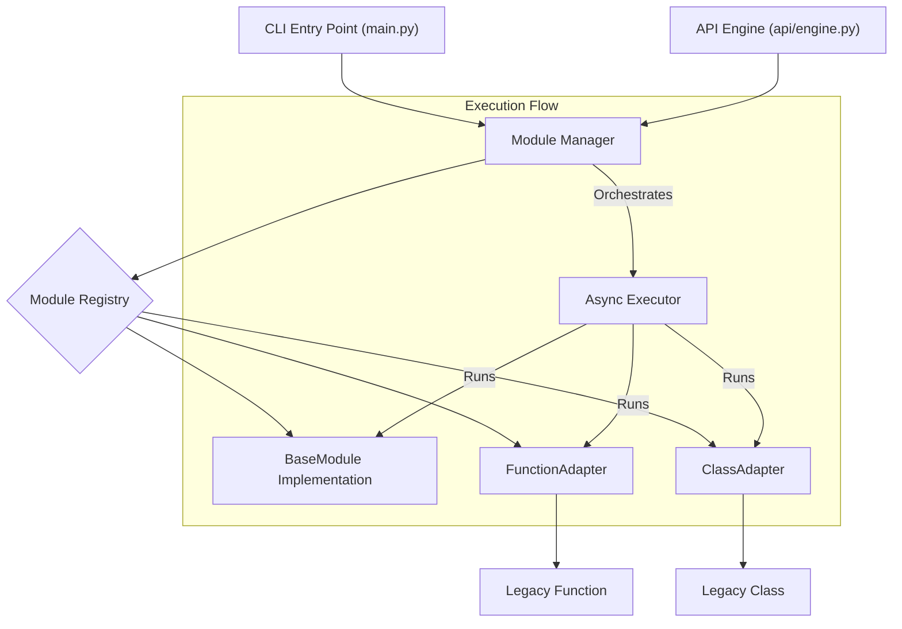

# Web Analyzer Tool

## Overview
The **Web Analyzer Tool** is a comprehensive Python-based application designed for domain analysis, including WHOIS information retrieval, DNS records, subdomain discovery, SEO analysis, web technology detection, and advanced security analysis. The tool also features Cloudflare bypass capabilities, contact information discovery, zero-day vulnerability scanning, and subdomain takeover detection.

---

## Architecture

WebAnalyzer has been refactored to use a highly modular and extensible architecture, making it easy to add new scanning capabilities without modifying the core engine.

### Core Components

1.  **ModuleManager**: The central heart of the application. It handles:
    *   Dynamic registration of modules.
    *   Dependency management (ensuring prerequisites are run).
    *   Concurrent execution of scanning tasks.
    *   Standardized error handling and result aggregation.

2.  **BaseModule**: An abstract base class that all new modules implement. It defines the standard interface (`run` method, metadata).

3.  **Adapters**: A flexible compatibility layer that allows:
    *   **FunctionAdapter**: Wrapping simple standalone functions as full modules.
    *   **ClassAdapter**: Integrating existing class-based tools seamlessly.

### Architecture Diagram



### Key Features of New Architecture

*   **Extensibility**: Create a new file in `modules/`, inherit from `BaseModule`, and register it. No need to touch `main.py`.
*   **Consistency**: Unified execution logic for both CLI and API.
*   **Performance**: Built-in support for asynchronous execution, allowing concurrent scans.
*   **Isolation**: Failures in one module are handled gracefully and do not crash the entire scan.

---

## Modules

The Web Analyzer features the following modules:

### Core Analysis Modules

- **Domain Info** - Retrieves comprehensive WHOIS information and registration details for domains.

- **Domain DNS** - Analyzes DNS records including A, AAAA, MX, NS, TXT and other record types.

- **Subfinder Tool** - Powerful subdomain discovery and enumeration capabilities.

- **SEO Analysis** - Evaluates search engine optimization factors including meta tags and content analysis.

- **Web Technologies** - Detects frontend and backend technologies, frameworks, and services.

### Security Modules

- **Security Analysis** - Performs comprehensive security checks for common vulnerabilities and misconfigurations.

- **Cloudflare Bypass** - Bypasses Cloudflare and other WAF protections to enable analysis of protected websites.

- **Nmap Zero Day** - Advanced vulnerability scanning to identify potential zero-day vulnerabilities.
- **Subdomain Takeover** - Detects vulnerable subdomains that are susceptible to takeover attacks.

### API Security Modules

- **API Fuzzer** - Fuzzes REST API endpoints using OpenAPI/Swagger schemas to find BOLA/IDOR vulnerabilities.
- **GraphQL Scanner** - Audits GraphQL endpoints for introspection, query depth limits, tracing detection, field suggestions, batching attacks, and CSRF vulnerabilities.
- **IoT Scanner** - Scans local or remote targets for IoT devices, mapping them to potential CVEs and checking for common default credentials.

### System & Monitoring

- **MSF Job Monitor** - Real-time monitoring of active Metasploit jobs.
- **Backend Console** - Live system logs displayed in the frontend interface.

### Advanced Modules

- **Advanced Content Scanner** - Deep analysis of web content to discover sensitive information and potential risks.

- **Contact Spy** - Discovers and extracts contact information from websites.

### Service Integration

- **Socket Service** - Run Web Analyzer as a service, enabling remote access and API-like functionality.

---

## Module Technology Stack

WebAnalyzer aggregates multiple powerful tools into a single workflow. Here is the breakdown of the underlying technology for each module:

| Module | Underlying Tool / Library | Description |
| :--- | :--- | :--- |
| **Domain Info** | `python-whois` | Queries WHOIS servers for registrar data. |
| **DNS Records** | `dnspython` | Resolves A, MX, NS, TXT records. |
| **Subdomain Discovery** | **`subfinder`** (Go) | Fast passive subdomain enumeration tool. |
| **Port Scan** | **`Nmap`** | Standard TCP connection scan. |
| **IoT Scanner** | **`Nmap`** + CVE DB | Service detection (`-sV`) on 30+ IoT ports; maps vendors to known CVEs and checks default creds. |
| **Vulnerability Scanner** | **`Nmap`** (NSE) | Runs `--script vuln` (vulners) for CVE detection and UDP scan for SNMP (`snmp-sysdescr`). |
| **Network Topology** | **`Nmap`** | Uses `--traceroute` and ICMP/TCP ping to map network hops. |
| **Metasploit Suggester** | **Metasploit** (RPC) | Matches detected tech/CVEs against local Metasploit module database. |
| **MSF Deep Scan** | **Metasploit** (Auxiliary) | Runs specific scanners (`wordpress_login`, `log4shell_scanner`, `heartbleed`, etc.). |
| **Active Pentest** | **Metasploit** (Exploit) | **Safety Warning**: Executes actual exploits (`exploit/*`) via RPC. |
| **Web Technologies** | Custom Signature Matching | Identifies CMS, frameworks, and servers via header/HTML keywords. |
| **Cloudflare Bypass** | `cloudscraper` / custom | Bypasses Javascript challenges to access WAF-protected pages. |
| **Advanced Content** | `BeautifulSoup` + Regex | Crawls JS files and HTML for API keys, secrets, and endpoints. |
| **Contact Spy** | `BeautifulSoup` + Regex | Extracts emails, phones, and social links using regex & DOM parsing. |
| **API Fuzzer** | `requests` + `PyYAML` | Parses OpenAPI schemas and fuzzes endpoints for IDOR/BOLA. |
| **GraphQL Scanner** | `requests` + `graphql-cop` | Checks introspection, tracing, batching, and suggestion attacks. |
| **MSF Job Monitor** | `pymetasploit3` | Polls Metasploit RPC for active job status. |

---

## Installation

### Requirements
Ensure the following dependencies are installed:
- Python 3.x
- Go (for Subfinder)
- Git

### Installation Steps

1. Clone the repository:
   ```bash
   git clone https://github.com/frkndncr/WebAnalyzer.git
   cd WebAnalyzer
   ```
2. Run the Install Python Dependencies:
   ```bash
   pip install -r requirements.txt --break-system-packages
   ```
   
2. Run the setup script:
   ```bash
   ./setup.sh
   ```
   This script will:
   - Install required system packages.
   - Install and configure **Subfinder**.

3. Verify the installation:
   - Ensure `subfinder` is available in your PATH.
   - Ensure all Python modules are installed successfully.

---

## Usage

1. Run the main script:
   ```bash
   python main.py
   ```

2. Enter the domain name when prompted:
   ```
   Please enter a domain name (e.g., example.com): yourdomain.com
   ```

3. The tool will:
   - Perform all analyses.
   - Display results on the terminal.
   - Save all results in a structured JSON file under `logs/{domain}/results.json`.

---

### 3. (Optional) Metasploit Integration
To use the **Verification** and **Active User** features, you must have Metasploit running in RPC mode.
1.  Ensure Metasploit Framework is installed (`brew install metasploit` or via installer).
2.  Run the helper script:
    ```bash
    ./scripts/start_msfrpc.sh
    ```
    *Or manually:* `msfrpcd -P toor -U msf -f -a 127.0.0.1`

---

## Web & API Usage

### 1. Start Support API
```bash
uvicorn api.main:app --reload
```
API runs at `http://127.0.0.1:8000`.

### 2. Start Frontend UI
```bash
cd web
npm install
npm run dev
```
Web UI runs at `http://localhost:5173`.
- **Minimalist Interface**: Select modules and run scans visually.
- **Scan Mode**: Toggle between **DOMAIN** (external) and **LOCAL NETWORK** (internal subnet) scanning.
    - *Local Mode* automatically optimizes the engine to skip domain-specific checks (SEO, DNS) and focus on Network/IoT discovery.
- **Categorized Modules**: Modules are grouped by logical category (Recon, Discovery, Vulnerability, Exploitation).
- **Live Console**: Real-time backend status logs displayed directly in the UI.
- **Port Scan**: View open ports and services in a structured table.


---

## Project Structure
```plaintext
.
├── main.py                 # Entry point of the application
├── socket.py               # Socket server implementation for remote access
├── setup.sh                # Installation script
├── requirements.txt        # Python dependencies
├── logs/                   # Directory to store analysis results
├── modules/                # Directory containing all analysis modules
│   ├── domain_dns.py       # DNS record analysis module
│   ├── domain_info.py      # WHOIS information retrieval module
│   ├── seo_analysis.py     # SEO and analytics analysis module
│   ├── security_analysis.py# Security analysis module
│   ├── subfinder_tool.py   # Subdomain discovery module
│   ├── web_technologies.py # Web technology detection module
│   ├── subdomain_takeover.py # Subdomain takeover vulnerability detection module
│   ├── advanced_content_scanner.py # Advanced web content scanning module
│   ├── cloudflare_bypass.py # Cloudflare and WAF bypass module
│   ├── contact_spy.py      # Contact information discovery module
│   ├── nmap_zero_day.py    # Zero-day vulnerability scanning module
└── tests/                  # Test scripts for the project
    └── test_main.py        # Unit tests for main.py
```

---

#
---
## Contribution
Feel free to contribute to this project by:
- Reporting issues.
- Suggesting features.
- Submitting pull requests.
---
## License
This project is licensed under the MIT License.
